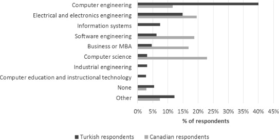

<!-- _backgroundColor: LightGray -->

<!-- _color: #008080 -->

<!-- paginate: false -->

# Job Description (Computer Engineering)

#### Fall semester, 2022-2023

Download [DOC](week-1.en.md_doc.pdf), [SLIDE](week-1.en.md_slide.pdf), [PPTX](week-1.en.md_slide.pptx)

<iframe width=700, height=500 frameBorder=0 src="../week-1.en.md_slide.html"></iframe>

---

<!-- paginate: true -->

## What is Computer Engineering

- Based on Computer Science theory, computers
anything that can help and make our life easier.
hardware, software, networks, security
components, databases, etc. systems with answers
science produces.

---

# *What Does a Computer Engineer Do?*

---

Computer engineer from unmanned aerial vehicles to banking applications,
from social media to mobile environments, surgeon robots
to the vehicles that can park themselves with the innovations it produces.
It changes our lives in every way.

        
 
---

## Requirements to Become a Successful Computer Engineer
- Mathematical acumen and problem solving ability
- Creativity
- Predisposition to Teamwork
- Communicate Effectively and Take Responsibility

---

### Which Can Work in Institutions

- Information for defense industry and military institutions  
- Hospital information system automation
- Finance and banking systems
- Sectors such as automotive, white goods, textile
computer aided manufacturing systems
- Entertainment industry
- Universities and research centers
- ...

---

### What Job Title Do They Work in?

- **Canada and Turkey Comparative Table**
Compared to Canada, we see more people working as computer engineers in Turkey. This shows that it would be more beneficial to develop in the field of computer engineering for those who want to work in Turkey.

---

## References

- http://www.cs.bilkent.edu.tr/data/bilgisayartanitim.pdf
- https://www.sciencedirect.com/science/article/abs/pii/S0164121215001314
- https://www.etu.edu.tr/tr/bolum/bilgisayar-muhendisligi?pgNb=9